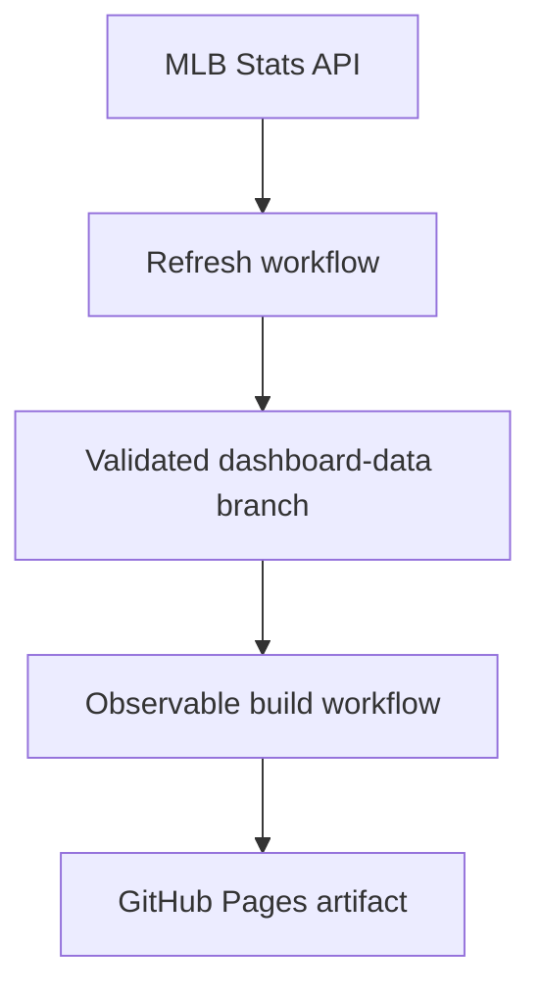

# MLB Pitch Workload Dashboard

[Open the live dashboard](https://tomoyakanno.github.io/mlb_pitch_dashboard/)

An interactive, static dashboard that ranks all 30 MLB teams by pitches thrown and separates starter and reliever workload. It calculates its own aggregates from the public MLB Stats API, preserves a validated season snapshot in git, and publishes a browser-only site through GitHub Pages.

The production application is the Observable Framework site in `observable/`. The older FastAPI/Vite application remains in `app/` and `frontend/` as a local runtime fallback, but it is not the deployed source of truth.

## What the dashboard measures

- **Total pitches** thrown by each team's pitchers.
- **Official SP and RP workload** using MLB's per-game `gamesStarted` designation.
- **Role-adjusted SP and RP workload** for opener and bulk-pitcher games.
- **Bullpen share**, **reclassified pitches**, per-game rates, and appearances that need human review.

The official starter is not inferred from appearance order, pitch count, or effectiveness. A starter who is removed after one inning remains an official SP. The role-adjusted view is a separate analytical layer:

- An official start remains SP by default, including a short or ineffective start.
- A reliever is moved to SP only when he throws at least 45 pitches and has another official MLB start within 28 days.
- An official starter is moved to RP only when he has an opener-shaped outing and strongly relief-dominant surrounding usage.
- A long relief outing without MLB starter evidence remains RP and is flagged for review.
- `config/role_overrides.json` can resolve known edge cases by `gamePk:playerId`.

This deliberately avoids treating every long reliever, Triple-A call-up, or emergency bulk pitcher as a starter.

## Production architecture



Source, durable data, and compiled output live in different places:

| Location | Purpose |
| --- | --- |
| `main` | Application, pipeline, configuration, tests, and documentation |
| `dashboard-data` | Machine-managed, normalized season snapshots; never merged into `main` |
| GitHub Actions artifact | Ephemeral compiled site served by GitHub Pages; never committed |

The deployed browser makes no MLB API requests and needs no backend. It downloads a small, browser-ready aggregate generated during the build.

## Refresh and deployment lifecycle

`Refresh dashboard data` runs at 5:17 a.m. America/New_York from March through November. It can also be run manually from the Actions tab.

1. Read the published season from `config/dashboard.json`.
2. Load the previous snapshot from `dashboard-data`.
3. Request the completed-game schedule.
4. Fetch only missing games, prior failures, and games inside the seven-day reconciliation window. A forced run fetches every completed game.
5. Classify appearances, validate structural and arithmetic invariants, write normalized JSONL partitions, and verify the persisted files and hashes.
6. Commit the snapshot to `dashboard-data` only after validation succeeds.
7. Trigger `Build and deploy dashboard`, which checks out `main` and `dashboard-data`, exports all 30 team totals, builds the site, and deploys a Pages artifact.

The configured season changes intentionally rather than rolling over on January 1. This prevents the dashboard from being replaced with an empty new-season dataset before regular-season games exist.

To refresh manually, open **Actions → Refresh dashboard data → Run workflow** on `main`. Leave season blank to use the configured season, keep **Force rebuild** off for a normal incremental update, and keep the reconciliation window at seven days unless investigating a correction. A successful refresh automatically starts the deployment workflow.

The shared MLB client caps concurrency, paces new requests, retries `429` and `5xx` responses with jittered exponential backoff, and honors a numeric `Retry-After` header. The defaults can be tuned for local or recovery runs:

| Variable | Default | Meaning |
| --- | --- | --- |
| `MLB_CONCURRENCY` | `8` | Maximum in-flight requests |
| `MLB_RATE_LIMIT` | `5` | Maximum request starts per second; `0` disables pacing |

### Failure behavior

- One failed game does not discard the rest of a refresh.
- A failed first fetch is marked **missing**.
- A failed reconciliation fetch retains its last-known-good appearances and is marked **stale**.
- A schedule regression, corrupt file, hash mismatch, missing official starter, duplicate appearance, unclassified appearance, or unbalanced team total blocks the snapshot write.
- A failed refresh does not trigger deployment.
- A failed build does not replace the last successful Pages artifact.
- The published status strip exposes complete/partial state, current/stale/missing games, generation time, and API-call count.

## Local development

Use Python 3.12 and Node.js 22 to match GitHub Actions.

### Static dashboard with the fixture

The committed fixture is small and is intended for fast UI work and CI:

```bash
cd observable
npm ci
npm run dev
```

The terminal prints the local preview URL. Useful checks are:

```bash
npm run typecheck
npm test
OBSERVABLE_TELEMETRY_DISABLE=true npm run build
```

### Static dashboard with the durable snapshot

Check out the data branch beside the source repository, then give Observable an absolute path:

```bash
git worktree add ../mlb-pitch-dashboard-data dashboard-data
DASHBOARD_DATA_DIR="$PWD/../mlb-pitch-dashboard-data" npm --prefix observable run build
```

The season defaults to `config/dashboard.json`; set `DASHBOARD_SEASON` only when intentionally building a different historical season.

### Pipeline checks

```bash
python -m venv .venv
source .venv/bin/activate
python -m pip install -r requirements-dev.txt
python -m pytest -q
```

To update a disposable local snapshot rather than the production data branch:

```bash
python -m pipeline.update --season 2026 --data-dir ./tmp-dashboard-data
python -m pipeline.check --season 2026 --data-dir ./tmp-dashboard-data
```

The first command performs a full bootstrap when the directory is empty. Use reasonable request pacing and do not repeatedly force a full-season refresh.

## Observable and React integration

Observable Framework renders TSX with its self-hosted React runtime. Components using hooks must import React symbols through `npm:react`, not the ordinary bare `react` package import. Mixing those paths can bundle two React instances: type-checking, unit tests, and the production build may all pass while the deployed page crashes with an invalid-hook-call error.

`observable/tsconfig.json` maps `npm:react` to the installed React type declarations for TypeScript only. The Pages workflow also rejects a build whose generated `index.html` includes a second `_node/react` runtime. UI changes should still be opened in a real browser and checked for rendered content, working controls, and console errors.

## GitHub Actions

Three workflows divide responsibilities:

| Workflow | Responsibility | Write access |
| --- | --- | --- |
| `CI` | Python tests, legacy frontend checks, and fixture-based Observable checks | None |
| `Refresh dashboard data` | Incrementally update and validate `dashboard-data` | Repository contents only |
| `Build and deploy dashboard` | Validate real data, build the static site, and deploy after merge or refresh | Pages deployment only in the deploy job |

Pull requests build against the real data branch but do not deploy. Production refresh handoffs are accepted only from `main`, and PR validation has a separate concurrency group so it cannot cancel a production deployment.

See [`docs/continuous-integration.md`](docs/continuous-integration.md), [`docs/data-branch-workflow.md`](docs/data-branch-workflow.md), and [`docs/deployment.md`](docs/deployment.md) for operational details.

## Legacy runtime fallback

The original application uses FastAPI, SQLite, and a Vite/React frontend. It supports an interactive **Refresh from MLB** button and detailed audit/failure endpoints, but production Pages does not depend on it.

```bash
python -m venv .venv
source .venv/bin/activate
python -m pip install -r requirements.txt

cd frontend
npm ci
npm run build
cd ..

uvicorn app.main:app --reload
```

Open <http://127.0.0.1:8000>. Run one application worker because its refresh lock and progress state remain in process memory. The Dockerfile builds the legacy frontend automatically and persists SQLite at `/data/mlb.sqlite3` when a volume is mounted.

Legacy endpoints include `/api/refresh`, `/api/status`, `/api/teams`, `/api/audit`, `/api/failures`, and `/health`.

## Repository map

- `pipeline/` — durable snapshot schema, storage, refresh, validation, integrity check, and export.
- `observable/` — production static dashboard, fixture, React components, styles, and metric tests.
- `app/` — shared MLB client and classification logic plus the legacy FastAPI backend.
- `frontend/` — legacy Vite/React frontend.
- `config/dashboard.json` — intentionally selected production season.
- `config/role_overrides.json` — reviewed per-appearance role overrides.
- `docs/` — data contract, data-branch operations, CI, and deployment recovery.
- `.github/workflows/` — CI, data refresh, and Pages deployment automation.

## Data and usage note

This is an unofficial personal project. MLB endpoints and response shapes can change without notice. The role-adjusted view is a transparent heuristic, not an MLB designation, and ambiguous appearances remain visible for review.
