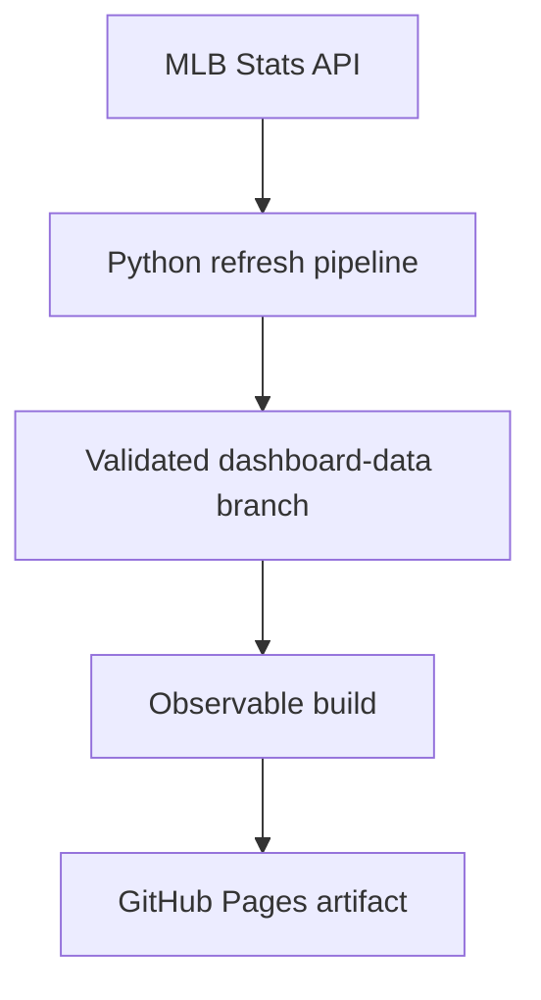

# MLB Pitch Workload Dashboard

[Open the live dashboard](https://tomoyakanno.github.io/mlb_pitch_dashboard/)

An interactive static dashboard that ranks all 30 MLB teams by pitches thrown and separates starter and reliever workload. It calculates its aggregates from the public MLB Stats API, preserves validated season snapshots in git, and publishes a browser-only site through GitHub Pages.

The Observable Framework application in `observable/` is the only supported user interface. Production has no application server or runtime database, and the browser makes no MLB Stats API calls — every pitch aggregate is precomputed at build time. The browser does load static display assets, currently team logos, directly from MLB's public CDN so those images never need to be committed to the repository or served from Pages. This keeps the deployment a pure static GitHub Pages site.

## What the dashboard measures

- **Total pitches** thrown by each team's pitchers.
- **Official SP and RP workload** using MLB's per-game `gamesStarted` designation.
- **Role-adjusted SP and RP workload** for opener and bulk-pitcher games.
- **Bullpen share**, **reclassified pitches**, per-game rates, and appearances that need human review.

The official starter is not inferred from appearance order, pitch count, outing length, or effectiveness. A starter removed after one inning remains an official SP. The role-adjusted view is a separate analytical layer:

- An official start remains SP by default, including a short or ineffective start.
- A reliever is moved to SP only when he throws at least 45 pitches and has another official MLB start within 28 days.
- An official starter is moved to RP only when he has an opener-shaped outing and strongly relief-dominant surrounding usage.
- A long relief outing without MLB starter evidence remains RP and is flagged for review.
- `config/role_overrides.json` can resolve known edge cases by `gamePk:playerId`.

This deliberately avoids treating every long reliever, Triple-A call-up, or emergency bulk pitcher as a starter.

## Architecture



| Location | Purpose |
| --- | --- |
| `main` | Application, pipeline, configuration, tests, and documentation |
| `dashboard-data` | Machine-managed normalized season snapshots; never merged into `main` |
| GitHub Actions artifact | Ephemeral compiled site served by GitHub Pages; never committed |

The deployed browser downloads a small team-level aggregate generated at build time. Data acquisition, role classification, persistence, validation, and export all happen before deployment.

## Refresh and deployment lifecycle

`Refresh dashboard data` runs at 5:17 a.m. America/New_York from March through November. It can also be run manually from the Actions tab.

1. Read the published season from `config/dashboard.json`.
2. Load the previous snapshot from `dashboard-data`.
3. Request the completed-game schedule.
4. Fetch only missing games, prior failures, and games inside the seven-day reconciliation window. A forced run fetches every completed game.
5. Classify appearances, validate structural and arithmetic invariants, write normalized JSONL partitions, and verify the persisted files and hashes.
6. Commit the snapshot to `dashboard-data` only after validation succeeds.
7. Trigger `Build and deploy dashboard`, which checks out current source and data, exports all 30 team totals, builds the site, and deploys a Pages artifact.

The configured season changes intentionally rather than rolling over on January 1. This prevents an empty new-season dataset from replacing an established snapshot before regular-season games exist.

To refresh manually, open **Actions → Refresh dashboard data → Run workflow** on `main`. Leave season blank to use the configured season, keep **Force rebuild** off for a normal incremental update, and retain the seven-day reconciliation window unless investigating a correction.

The MLB client caps concurrency, paces request starts, retries `429`, `5xx`, and transport failures with jittered exponential backoff, and honors a numeric `Retry-After` header.

| Variable | Default | Meaning |
| --- | --- | --- |
| `MLB_CONCURRENCY` | `8` | Maximum in-flight requests |
| `MLB_RATE_LIMIT` | `5` | Maximum request starts per second; `0` disables pacing |

### Failure behavior

- One failed game does not discard successful games from the same refresh.
- A failed first fetch is marked **missing**.
- A failed reconciliation fetch retains its last-known-good appearances and is marked **stale**.
- A schedule regression, corrupt file, hash mismatch, missing official starter, duplicate appearance, unclassified appearance, or unbalanced team total blocks the snapshot write.
- A failed refresh does not trigger deployment.
- A failed build does not replace the last successful Pages artifact.
- The dashboard exposes complete/partial state, current/stale/missing games, generation time, and API-call count.

## Local development

Use Python 3.12 and Node.js 22 to match GitHub Actions.

### Dashboard with the fixture

The committed fixture is intended for fast UI work and CI:

```bash
cd observable
npm ci
npm run dev
```

Validation commands:

```bash
npm run typecheck
npm test
OBSERVABLE_TELEMETRY_DISABLE=true npm run build
```

### Dashboard with the durable snapshot

Check out the data branch beside the source repository and provide its absolute path:

```bash
git worktree add ../mlb-pitch-dashboard-data dashboard-data
DASHBOARD_DATA_DIR="$PWD/../mlb-pitch-dashboard-data" npm --prefix observable run build
```

The season defaults to `config/dashboard.json`; use `DASHBOARD_SEASON` only when intentionally building another season.

### Pipeline

```bash
python -m venv .venv
source .venv/bin/activate
python -m pip install -r requirements-dev.txt
python -m pytest -q
```

To create or update a disposable local snapshot:

```bash
python -m pipeline.update --season 2026 --data-dir ./tmp-dashboard-data
python -m pipeline.check --season 2026 --data-dir ./tmp-dashboard-data
```

An empty directory performs a full bootstrap. Avoid repeatedly forcing a full-season refresh.

## Observable and React integration

Observable Framework renders TSX with its self-hosted React runtime. Components using hooks must import React symbols through `npm:react`, not a bare `react` import. Mixing those paths can bundle two React instances: type-checking, tests, and builds may pass while the deployed page crashes with an invalid-hook-call error.

`observable/tsconfig.json` maps `npm:react` to installed React declarations for TypeScript only. The Pages workflow also rejects generated output containing a second `_node/react` runtime. UI changes still require a browser smoke test for rendered content, working controls, and console errors.

## GitHub Actions

| Workflow | Responsibility | Write access |
| --- | --- | --- |
| `CI` | Python pipeline tests and fixture-based Observable checks | None |
| `Refresh dashboard data` | Incrementally update and validate `dashboard-data` | Repository contents only |
| `Build and deploy dashboard` | Validate real data, build the static site, and deploy after merge or refresh | Pages deployment only in the deploy job |

Pull requests build against the real data branch but do not deploy. Production refresh handoffs are accepted only from `main`, and PR validation has a separate concurrency group so it cannot cancel a production deployment.

See [continuous integration](docs/continuous-integration.md), [the data contract](docs/data-contract.md), [data-branch operations](docs/data-branch-workflow.md), and [deployment recovery](docs/deployment.md).

## Repository map

- `pipeline/mlb.py` — MLB API access, request pacing, retries, and boxscore parsing.
- `pipeline/classify.py` — pure role-classification domain logic.
- `pipeline/` — snapshot schema, storage, refresh, validation, integrity checking, and export.
- `observable/` — the static dashboard, fixture, data loader, React components, styles, and tests.
- `config/dashboard.json` — intentionally selected production season.
- `config/role_overrides.json` — reviewed per-appearance role overrides.
- `docs/` — data contract, data-branch operations, CI, and deployment recovery.
- `.github/workflows/` — CI, data refresh, and Pages deployment automation.

## Data and usage note

This is an unofficial personal project. MLB endpoints and response shapes can change without notice. The role-adjusted view is a transparent heuristic, not an MLB designation, and ambiguous appearances remain visible for review.

