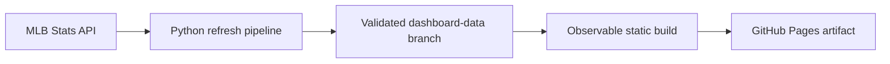

# MLB Pitch Workload Dashboard

[Open the live dashboard](https://tomoyakanno.github.io/mlb_pitch_dashboard/)

An interactive view of MLB pitcher workload. It ranks all 30 teams and the top 30 pitchers by pitches thrown, separates official starter and reliever work, and adds recent-game schedule context without claiming to measure fatigue or readiness.

The supported product is a static Observable Framework site. A Python pipeline reads the public MLB Stats API, validates a durable snapshot, and creates browser-ready aggregates during the site build. Production has no application server, runtime database, or client-side MLB data requests. Team logos and pitcher portraits are display assets loaded from MLB's public CDN.

## What it shows

- **Recent strain** — one team's latest available completed-game pitcher usage, next matchup and optional probable starter, 14-day bullpen workload, and active-starter rest context.
- **Season leaders** — team total, official or role-adjusted SP/RP workload, bullpen share, role adjustments, per-game rates, and the top 30 pitchers.
- **Team timelines** — cumulative or daily workload on a shared season date axis, with game-level complete-game notes.
- **Player history** — the selected season alongside the prior three completed seasons for a current top-30 pitcher.

Official SP/RP comes directly from MLB's per-game `gamesStarted` value and is never inferred from appearance order, pitch count, outing length, or effectiveness. The separate role-adjusted view conservatively reclassifies opener and bulk-pitcher games, flags ambiguous long relief for review, and applies reviewed per-season exceptions from `config/role_overrides.json`. The full rule and its audit trail are specified in [the durable data contract](docs/data-contract.md).

## Architecture



| Location | Ownership |
| --- | --- |
| `main` | Human-maintained source, tests, configuration, workflows, and documentation |
| `dashboard-data` | Orphan, machine-managed validated snapshots; never merged into `main` |
| Pages artifact | Ephemeral compiled site; never committed |

There is one active source/data contract. Meaningful schema or export changes rebuild the durable data rather than preserving compatibility with old snapshots. This keeps validation at clear boundaries instead of accumulating migration code for versions that cannot be live together.

The refresh workflow updates missing games, prior failures, and a recent reconciliation window. It preserves last-known-good appearances when a refetch fails, marks first-time failures missing, validates both before and after serialization, and commits only a valid snapshot. A failed refresh or build leaves the prior Pages site online.

See [the durable data contract](docs/data-contract.md) for snapshot semantics and [deployment operations](docs/deployment.md) for schedules, workflow boundaries, manual runs, and recovery.

## Local development

Use Python 3.12 and Node.js 22 to match GitHub Actions.

### Static dashboard with fixtures

```bash
cd observable
npm ci
npm run dev
```

The committed fixture keeps UI work fast and independent of the production data branch.

```bash
npm run typecheck
npm test
OBSERVABLE_TELEMETRY_DISABLE=true npm run build
```

### Static dashboard with validated data

Check out the data branch beside this repository and point the build at its absolute path:

```bash
git worktree add ../mlb-pitch-dashboard-data dashboard-data
DASHBOARD_DATA_DIR="$PWD/../mlb-pitch-dashboard-data" npm --prefix observable run build
```

The season comes from `config/dashboard.json`. Set `DASHBOARD_SEASON` only when intentionally building another season.

### Pipeline

```bash
python -m venv .venv
source .venv/bin/activate
python -m pip install -r requirements-dev.txt
python -m pytest -q
```

To create a disposable local snapshot:

```bash
python -m pipeline.update --season 2026 --data-dir ./tmp-dashboard-data
python -m pipeline.check --season 2026 --data-dir ./tmp-dashboard-data
```

An empty data directory performs a full bootstrap. Normal refreshes should remain incremental.

## Important implementation boundary

Observable Framework uses its self-hosted React runtime. Components using hooks must import React symbols from `npm:react`, not bare `react`; mixing the paths can produce a second runtime and a browser-only invalid-hook-call failure. A successful static build is therefore followed by compiled-payload verification and a browser smoke test for UI changes.

## Repository guide

- `pipeline/` — MLB access, classification, schema, persistence, refresh, validation, checking, and browser export.
- `observable/` — static site, fixtures, data loaders, components, styles, and presentation tests.
- `config/dashboard.json` — intentionally selected published season.
- `config/role_overrides.json` — reviewed per-appearance role exceptions.
- `.github/workflows/` — read-only CI, the sole automated data writer, and Pages build/deployment.
- `docs/data-contract.md` — durable snapshot and browser-export semantics.
- `docs/deployment.md` — operations, permissions, schedules, and recovery.

## Data and usage note

This is an unofficial personal project. MLB endpoints and response shapes can change without notice. Role adjustment is a transparent heuristic, not an MLB designation, and Recent strain is workload context rather than medical or readiness guidance.
